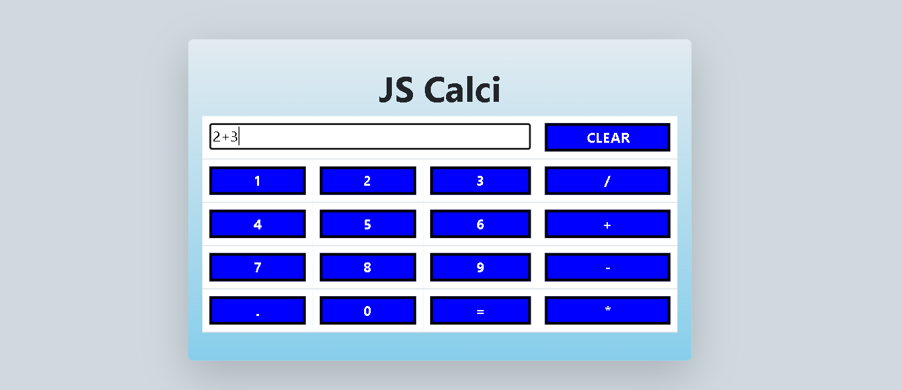

# 🧮 JavaScript Calculator

A simple and responsive **Calculator Web Application** built using **HTML**, **CSS**, **JavaScript**, and **Bootstrap 5**.  
This project performs basic arithmetic operations — addition, subtraction, multiplication, and division — with a clean, user-friendly interface.

---

## 📸 Demo

---

## 💡 Features

- ➕ Addition, ➖ Subtraction, ✖️ Multiplication, ➗ Division  
- 🧼 Clear button to reset input  
- 📱 Responsive design (works on all devices)  
- 🎨 Styled using Bootstrap and custom CSS  
- ⚡ Real-time calculations with JavaScript  

---

## 🧰 Technologies Used

- **HTML5**  
- **CSS3**  
- **Bootstrap 5**  
- **JavaScript (ES6)**  

---
